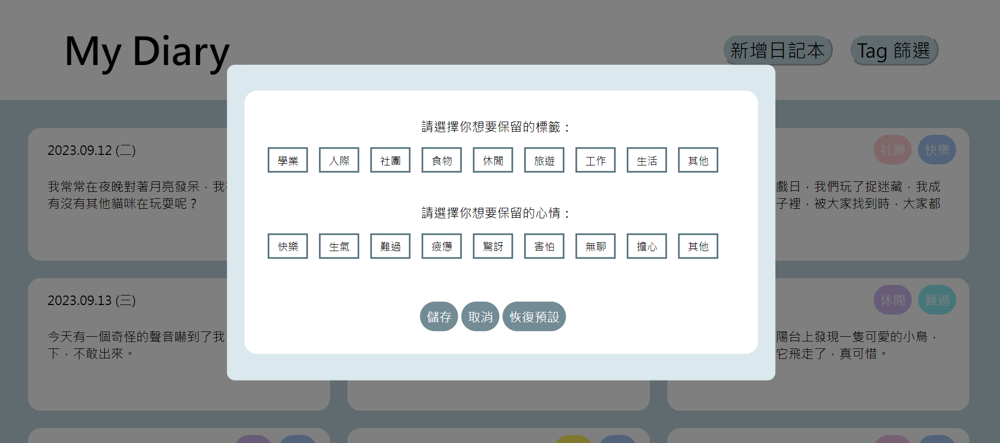
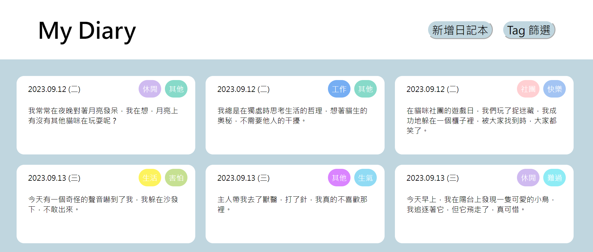
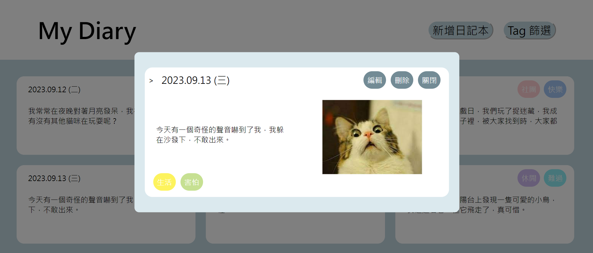
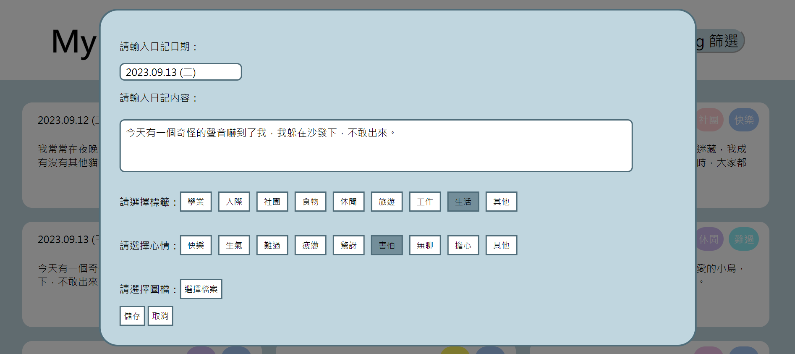

# Web Programming Hw1

## Project Overview

1. **首頁**容納每天的日記頁面，包含以下元素：
	- **標題**：My Diary 顯示於頁面上方的位置。
	- **日記卡**：在首頁內可看到各卡片的**日期、標籤、心情**。點擊日記卡時，便可以瀏覽其**日記頁內容**。
	- **「新增日記卡」按鈕**：點擊後會跳出一個空白的**日記頁**，並直接進入**編輯模式**以供使用者輸入內容。
		- 新增日記卡時，可以更改日記卡的日期。更改日期時會檢查該日期是否為合法日期，若不合法（如：2022.02.30、2023.13.01 等）則無法儲存日記卡。
		- 日記頁內可插入圖片並存到資料庫，並可從資料庫讀取圖片
	- **篩選**：篩選類別包含學業、人際、社團、快樂、生氣、難過...等，Filter 後僅顯示出含有任一所選類別的日記卡。
	
	- 圖示:
	
2. **日記頁**功能：
	**瀏覽模式：**
	- 可以清楚瀏覽日記內容、**日期、標籤、心情**
	- 「編輯」按鈕：按下後進入編輯模式（會出現「儲存」與「取消」按鈕）
	- 圖示:
		

	**編輯模式：**
	- 可編輯並清楚顯示出日記內容
	= 可編輯**標籤、心情**
	- 「儲存」與「取消」按鈕：
		如果這個日記頁是透過點擊「新增日記卡」打開的，則按「儲存」時，會在首頁新增對應這則日記的日記卡；如果這時按下「取消」，則不會新增日記卡。
		如果這個日記頁是透過點擊已存在的日記卡打開的，則按「儲存」時，儲存日記卡的內容；按下「取消」則不儲存。
		點擊「儲存」或「取消」按鈕，都離開編輯模式，回到瀏覽模式。
	- 圖示: 
	

## Run the Project

### 1. Clone the project

### 2. Install dependencies

```bash
cd backend
yarn
```
### 3. MongoDB and environment setup 

In /backend directory, create a file named .env

	Add port and mongo uri in .env

	```bash
	PORT=8000
	MONGO_URI=<your connection string>
	```
Beware that non-empty database may lead to unexpected errors. Please clear your database in advance.


### 4. Run the server

```bash
yarn start
```

### 5. Open the frontend

Open `frontend/index.html` by clicking it in your file explorer.

Or if you're on ubuntu, you can run the following command to open it in your browser.

```bash
cd frontend
xdg-open index.html
```

If you're on macOS, you can run the following command to open it in your browser.

```bash
cd frontend
open index.html
```


